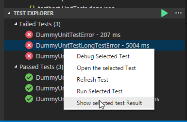
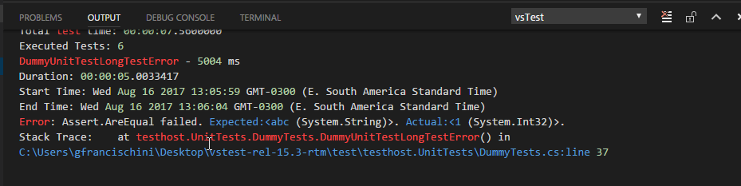

## Run tests in Test Explorer

When the extension is enabled it will automatically open the Test Explorer. The discovered test will appear on the windows like on the image below

As you run, write, and rerun your tests, Test Explorer displays the results in default groups of **Failed Tests**, **Passed Tests**, **Skipped Tests** and **Not Run Tests**.

### Run tests
You can run all the tests in the solution, all the tests in a group, or a set of tests that you select. Do one of the following:

* To run all the tests in a solution, click on the **...** and choose **Run All**.
* To run a specific test select the test and click on **Run**. You can also right click the test and select **Run Selected Test Case**
* To run a specific group of test select the test group and click on **Run** You can also right click the test group and select **Run Selected Test Group**

### Run tests after every build
You can enable or disable the run test after every build by adding a postBuildTask to your task.json.

## Run test progress
Every time a new test starts a progress indicator icon will be presented on the left side of test name.

## View test results

As you run, write, and rerun your tests, Test Explorer displays the results in groups of **Failed Tests**, **Passed Tests**, **Skipped Tests** and **Not Run Tests**. The output pane at the bottom of Test Explorer displays a summary of the test run.

### View test details
To view the details of an individual test, select the test, right click and select **Show Selected Test Results**

The result will be displayed on the **output window**

### View the source code of a test method
To display the source code for a test method in the Visual Studio Code editor you only need to left click the test. 

## Group and filter the test list
Group and filter is not supported yet.